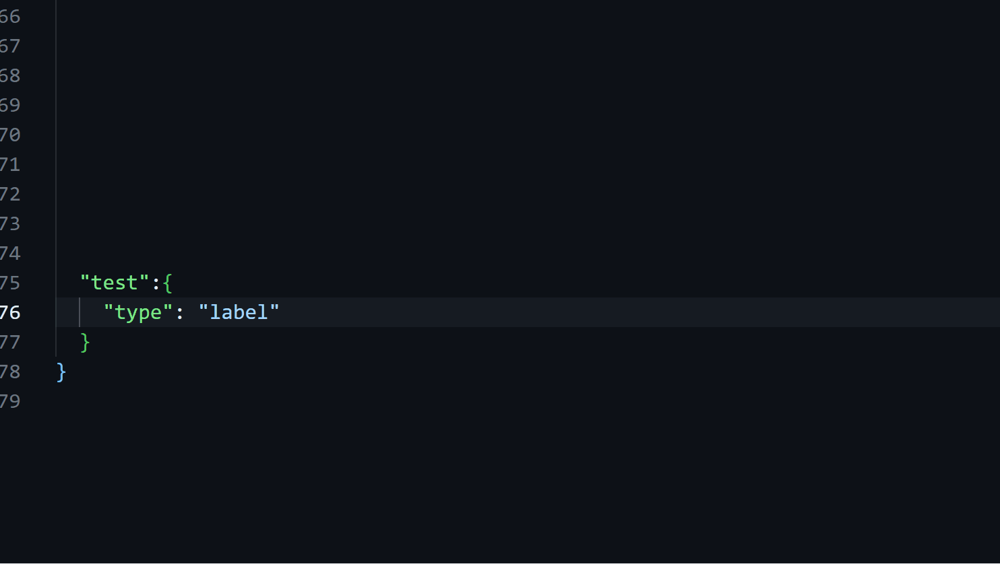

## JsonUI LSP

[-black)](https://feedback.minecraft.net/hc/en-us/articles/31222183227149-Minecraft-Bedrock-Edition-1-21-40-Bundles-of-Bravery)

### Introduction
This VSCode extension enhances the creation of Minecraft Bedrock JSON-UI by providing intelligent auto-completion features. It speeds up the development process and helps developers efficiently create and edit JSON-UI files.  

### Features
- **Intelligent Control Type and Value Suggestions**: Provides smart auto-completion for various JSON-UI control types and their associated values.
- **Variable Auto-Completion**: Supports intelligent context variable completion.
- **Binding Completion**: Offers context-aware suggestions for property bindings.
- **Color Palette Integration**: Enables quick selection of color variables with an integrated color palette.
- **Fast and Lightweight Completion Feedback**: Delivers responsive and efficient feedback with minimal memory usage.
- **Multi-Platform Support**: Fully compatible with Windows, macOS, and Linux.
- **Multi-Language Completion Labels**: Offers completion labels in both Chinese and English for an enhanced experience.

### Contributing
Contributions are welcome!

#### Complie guide
Development IDE with `vscode`, prepare `rust` and `nodejs` environment. Install pnpm package manager.
1. `pnpm i`
2. use nightly rust feature
 `rustup toolchain install nightly`
 `rustup override set nightly`
3. debug use `F5`

### License
This project is licensed under the MIT License.